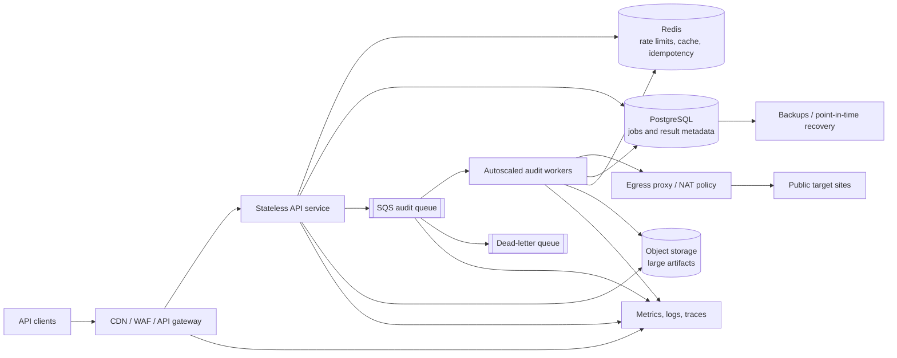

# PagePulse scale architecture

## Scope and service objectives

This design evolves PagePulse from a synchronous, single-instance API into a durable asynchronous service for 10,000 audits per day and bursts of 500 concurrent submissions. The burst, rather than the daily average of 0.12 audits/second, determines capacity.

The customer-facing objectives are:

| Signal | Service-level objective (rolling 30 days) |
|---|---|
| Submission availability | 99.9% of valid `POST /v1/audits` requests return a non-5xx response |
| Submission latency | p95 under 300 ms and p99 under 750 ms, measured at the API edge |
| Audit completion | 95% complete within 30 seconds and 99% within 90 seconds, excluding documented upstream failures |
| Status-read latency | p95 under 200 ms |
| Durability | No acknowledged job is lost |

The completion objective is separate from submission latency because PagePulse does not control target-site DNS, latency, or availability. An audit that reaches a terminal upstream error within the objective counts as completed, not successful.

## API behavior at scale

`POST /v1/audits` validates and normalizes the URL, checks quota and cache, and returns quickly:

- `200 OK` with the result for a fresh shared-cache hit.
- `202 Accepted` with `{ jobId, status: "queued", statusUrl }` for new work.
- The same job for the same tenant and idempotency key, making client retries safe.
- `429` when a tenant exceeds quota and `503` with `Retry-After` when admission control protects a saturated queue.

`GET /v1/audits/{jobId}` returns `queued`, `running`, `succeeded`, or `failed`. Optional webhooks can be added later; polling with exponential backoff is the initial contract. The existing synchronous endpoint can remain during migration, backed by the same job system with a short wait budget.

## Component diagram

## Components and responsibilities

| Component | Responsibility | Scaling model |
|---|---|---|
| CDN, WAF, API gateway | TLS, request-size limits, coarse IP protection, routing | Managed horizontal scale |
| API service | Authentication, validation, normalization, tenant quotas, cache/idempotency lookup, durable job creation | Stateless replicas, target 50% CPU |
| SQS standard queue | Durable buffering between admission and unpredictable network work | Managed; at-least-once delivery |
| Audit workers | SSRF validation, redirects, bounded fetch, HTML analysis, result persistence | Scale on queue depth and oldest-message age |
| Redis | Shared result cache, short idempotency records, distributed rate-limit counters | Multi-AZ primary/replica with bounded TTLs |
| PostgreSQL | Source of truth for jobs, ownership, state transitions, result metadata, and billing/audit history | Multi-AZ, connection-pooled |
| Object storage | Optional compressed response-derived artifacts too large for PostgreSQL | Managed, encrypted, lifecycle expiration |
| Egress layer | Restricts ports/protocols and records outbound destinations; defense in depth for SSRF | Redundant NAT/proxy instances or managed egress |
| Telemetry stack | Central metrics, structured logs, traces, dashboards, alert routing | Managed ingestion with retention controls |

## Data flow

1. The edge authenticates the client, rejects oversized payloads, and assigns or forwards a request ID.
2. The API validates the contract and URL syntax, normalizes the URL, and applies per-tenant rate and concurrency quotas in Redis.
3. It checks Redis for a recent result. A hit returns immediately.
4. For a miss, the API writes a `queued` job to PostgreSQL and an outbox row in one transaction. A relay publishes the outbox event to SQS and marks it published. This avoids acknowledging a job that was never queued.
5. The API returns `202` after the durable database commit; clients poll the status URL.
6. A worker receives the message, atomically claims the job, resolves and validates every destination/redirect, and fetches through controlled egress with strict time and byte limits.
7. The worker analyzes the HTML, writes the terminal result to PostgreSQL, stores any large artifact in object storage, and populates Redis with a TTL. It then acknowledges the queue message.
8. Duplicate deliveries observe a terminal job or lose the atomic claim and become no-ops. A failed message is retried or sent to the dead-letter queue.

## Queueing, capacity, and backpressure

SQS standard queues provide durable at-least-once delivery. Correctness therefore comes from idempotency, not an assumption of exactly-once delivery. `jobId` is the deduplication key; PostgreSQL permits only valid state transitions and has a unique `(tenant_id, idempotency_key)` constraint.

Workers start at 20 tasks and autoscale up to 250 concurrent audit slots. At the configured 10-second fetch deadline, a simultaneous burst of 500 jobs is processed in at most two nominal waves. The target is to add capacity when either the oldest queued message exceeds 5 seconds or visible messages exceed 100. Scale-in is deliberately slow to prevent oscillation.

Each worker process has bounded concurrency. Global tenant quotas and a per-host concurrency limit prevent one customer or origin from consuming every slot. Messages use a visibility timeout longer than the worker deadline, extended by a heartbeat for legitimate long processing. Transient failures retry three times with exponential backoff and full jitter. Invalid input and deterministic 4xx/content errors do not retry. Exhausted messages move to a DLQ for inspection and controlled replay.

Admission control rejects new uncached jobs with `503 Retry-After` if oldest-message age threatens the completion SLO or if dependencies cannot durably accept work. This is preferable to accepting work that cannot meet the promised service level.

## Where state lives

| State | Store | Lifetime / recovery |
|---|---|---|
| Job owner, URL hash, status, attempts, timestamps, compact result | PostgreSQL | Authoritative; point-in-time recovery and daily backups |
| Publish intent | PostgreSQL outbox | Retained until safely published, then periodically archived/deleted |
| Cached successful result | Redis | Derived, TTL 5–30 minutes; safe to lose and repopulate |
| Idempotency response | Redis plus PostgreSQL unique key | Redis for speed; PostgreSQL is the correctness backstop |
| Rate-limit counters | Redis | Short window TTL; fail-closed for paid quota, locally limited emergency mode for availability |
| Queue messages and retries | SQS / DLQ | Durable until acknowledged or retention expires |
| Large optional artifacts | Object storage | Encrypted, tenant-scoped, lifecycle deletion |
| Secrets | Managed secrets service | Versioned and injected at runtime; never stored in images or source |
| Logs, metrics, traces | Observability platform | Access-controlled retention based on operational need |

## Security and tenancy

The current URL normalization, DNS checks on every redirect, response-size cap, and timeout remain mandatory. Network policy permits only public HTTP/HTTPS destinations through controlled egress; cloud metadata, private ranges, link-local ranges, and non-web ports are blocked. Results and job reads are tenant-scoped. Data is encrypted in transit and at rest, secrets rotate through a managed store, and logs contain URL hashes or redacted URLs rather than query strings that may contain secrets.

## Deployment topology and migration

Run API and worker services across at least two availability zones. The API and worker deploy independently from immutable container images. Introduce the asynchronous endpoints behind a feature flag, shadow a small percentage of existing audits through the queue, then gradually move traffic while comparing results and latency. Vercel remains suitable for the current demonstration deployment; the scaled production topology uses long-lived workers because audit execution and queue consumption need predictable concurrency and network controls.

Related deliverables: [technology decisions](technology-decisions.md), [failure modes](failure-modes.md), and [observability and rollback](observability-rollback.md).
